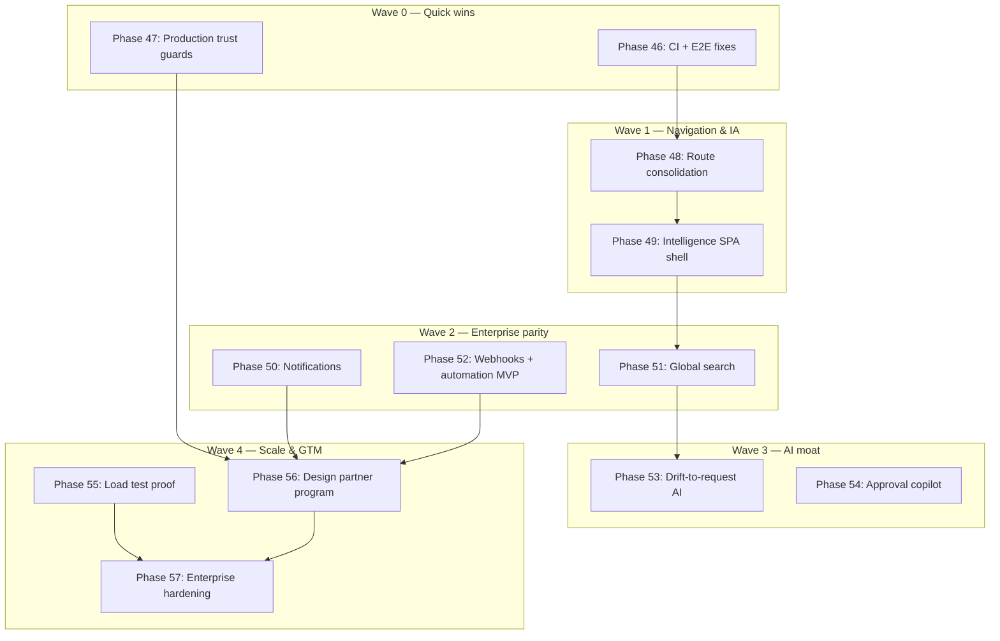

# Due Diligence Implementation Roadmap

**Source:** Comprehensive product & engineering audit (July 2026)  
**Goal:** Move EnhancementHub from **credible pilot (67/100)** to **world-class enterprise SaaS (80+/100)**  
**Audience:** Engineering leadership, product, and investors tracking execution

Related: [ROADMAP.md](ROADMAP.md) · [PRODUCT_SCORECARD.md](PRODUCT_SCORECARD.md) · [UX_DESIGN_SYSTEM.md](UX_DESIGN_SYSTEM.md)

---

## Executive summary

The audit identified three structural blockers:

1. **Trust gap** — mock AI, simulated QA, and InMemory vector defaults can surface in buyer demos  
2. **Experience gap** — hybrid Razor/React navigation feels like two products  
3. **Evidence gap** — no design-partner metrics; CI does not gate on 318 unit tests  

This roadmap sequences **~12 implementation phases (46–57)** across five waves. Quick wins ship first; SPA unification and GTM proof run in parallel tracks.

### Target score movement

| Dimension | Current | Wave 2 exit | Wave 5 exit |
|-----------|---------|-------------|-------------|
| Overall product quality | 67 | 72 | 80+ |
| Investment readiness | 55 | 62 | 75+ |
| Enterprise readiness | 68 | 74 | 82+ |
| Launch readiness | 62 | 70 | 78+ |

---

## Guiding principles

1. **Prove before polish** — CI gates and production validators before new features  
2. **One shell** — every user-facing page should feel like one application  
3. **Real over simulated** — production must never silently fake AI, QA, or search  
4. **Measure outcomes** — every wave ties to pilot metrics, not internal doc checkboxes  
5. **Incremental migration** — extend `SpaShell.tsx`; do not big-bang rewrite  

---

## Dependency overview

---

## Wave 0 — Quick wins (Phase 46)

**Theme:** Stop regressions and fix broken smoke paths  
**Complexity:** Low · **User impact:** Medium · **Risk:** Low

### Phase 46 — CI quality gate & E2E repair

| # | Task | Files / location | Acceptance criteria |
|---|------|------------------|---------------------|
| 46.1 | Add `dotnet test` job to GitHub Actions | `.github/workflows/ci.yml` (new) | PR fails if any of 318 tests fail; runs on `main` and `cursor/**` |
| 46.2 | Add `npm run build` for ClientApp in CI | Same workflow | Vite build + TypeScript compile must pass |
| 46.3 | Fix Playwright selectors for unified SPA | `tests/e2e/smoke.spec.ts`, `tests/e2e/helpers.ts` | Replace `#spa-dashboard-root`, `#spa-approval-queue-root`, etc. with `#spa-root` + route-specific assertions |
| 46.4 | Add bulk-action smoke test | `tests/e2e/smoke.spec.ts` | Select row → bulk approve/decline → toast visible |
| 46.5 | Wire Storybook to production CSS | `.storybook/preview.ts`, import `site.css` + Bootstrap | Components in Storybook match production tokens |
| 46.6 | Deduplicate risk badge logic | New `ClientApp/src/utils/riskLabels.ts` (exists) + shared Razor partial or API | Single source for risk class + label in React and Razor |
| 46.7 | 301 redirects legacy request routes | `Program.cs` or Razor page redirects | `/EnhancementRequests/*` → `/Spa/*` equivalents |
| 46.8 | Delete orphaned Vite entries | `ClientApp/src/entries/dashboard.tsx`, etc. | Only `spa-shell.tsx` entry remains |
| 46.9 | Recalibrate PRODUCT_SCORECARD | `docs/PRODUCT_SCORECARD.md` | Separate "internal capability" vs "external readiness"; customer proof stays honest |

**Exit criteria:** Green CI on every PR (unit + build + e2e smoke + static a11y).

---

## Wave 1 — Production trust (Phase 47)

**Theme:** Buyers must never discover silent simulation  
**Complexity:** Low–medium · **User impact:** High · **Risk:** Medium (config breaking changes)

### Phase 47 — Production configuration hardening

| # | Task | Files / location | Acceptance criteria |
|---|------|------------------|---------------------|
| 47.1 | Extend `ProductionConfigurationValidator` | `Infrastructure/Security/ProductionConfigurationValidator.cs` | Production rejects: empty `OpenAI`/`AzureOpenAI` keys when `Ai:RequireProviderInProduction=true`; `VectorSearch:Provider=InMemory`; `Delivery:QaRunner=Simulated` |
| 47.2 | Add `Ai:AllowMockInProduction` escape hatch | Same + `appsettings.Production.json` template | Explicit opt-in only; logs warning at startup |
| 47.3 | Prominent mock/simulation banners | `RequestDetailApp.tsx`, `IntakeCopilotPanel.tsx`, delivery panel | Persistent banner when `usedMockAi` or simulated QA; matches SOC2 transparency |
| 47.4 | Admin compliance widget for simulation status | `Soc2ReadinessService.cs`, `/Admin/Compliance` | Shows AI provider, vector backend, QA runner mode |
| 47.5 | Update eval compose defaults | `docker-compose.eval.yml`, `docs/PRODUCTION_EVAL.md` | Eval profile uses PgVector + documents mock AI behavior |
| 47.6 | Unit tests for new validators | `Phase15EnterpriseHardeningTests.cs` or new file | Production startup fails on misconfiguration |

**Exit criteria:** `ASPNETCORE_ENVIRONMENT=Production` cannot start with dev-grade AI/vector/QA defaults unless explicitly overridden.

---

## Wave 2 — Navigation & information architecture (Phases 48–49)

**Theme:** One application, one navigation model  
**Complexity:** High · **User impact:** Very high · **Risk:** Medium

### Phase 48 — Route consolidation & legacy deprecation

| # | Task | Files / location | Acceptance criteria |
|---|------|------------------|---------------------|
| 48.1 | Mark legacy Razor request pages obsolete | `Pages/EnhancementRequests/*` | Pages redirect; remove from `_SidebarNav` active logic |
| 48.2 | Unify breadcrumb + page title source | `_PageHeader.cshtml`, `PageHeader.tsx` | Same title/description pattern everywhere |
| 48.3 | Dashboard deep links to Intelligence | `DashboardApp.tsx` | Widgets: "N drift findings", "M repos stale" → `/Spa/SystemMap`, `/SchemaDrift` |
| 48.4 | Platform-aware command palette shortcut | `wwwroot/js/site.js` | Shows `Ctrl+K` on Windows/Linux, `⌘K` on macOS |
| 48.5 | Admin sub-nav on all admin pages | `_AdminNav.cshtml`, verify Jobs/Teams/API Keys/Compliance | Consistent secondary nav |
| 48.6 | SPA sidebar bridge for Intelligence links | `site.js` `initSpaNavigation()` | Document which routes stay full-page vs in-shell |

**Exit criteria:** No duplicate request list/detail/create flows; sidebar highlights correctly on `/` and `/Index`.

### Phase 49 — Intelligence pages in React shell (incremental)

Migrate high-traffic Intelligence pages into `SpaShell.tsx` routes. Order by traffic and demo script relevance.

| # | Page | New route | React app | BFF endpoints |
|---|------|-----------|-----------|---------------|
| 49.1 | Applications list | `/Spa/Applications` | `ApplicationsApp.tsx` | `GET /web-api/spa/applications` (extend existing) |
| 49.2 | Schema drift index | `/Spa/SchemaDrift` | `SchemaDriftApp.tsx` | `GET /web-api/spa/drift` |
| 49.3 | Repositories index | `/Spa/Repositories` | `RepositoriesApp.tsx` | `GET /web-api/spa/repositories` |
| 49.4 | Audit log | `/Spa/Audit` | `AuditApp.tsx` | `GET /web-api/spa/audit` |
| 49.5 | Safe Vite code splitting | `vite.config.ts` | `manualChunks: { vendor: ['react', 'react-dom', 'react-router-dom'] }` | No duplicate React (#321); measure bundle size |

**Per-page pattern:** Razor page becomes thin `_SpaRoot.cshtml` host; reuse `PageHeader`, `EmptyState`, `LoadingState`, `ErrorState`.

**Exit criteria:** Demo script (intake → map → drift → approval) runs without full page reload between steps.

---

## Wave 3 — Enterprise parity (Phases 50–52)

**Theme:** Close gaps vs HubSpot, Linear, Stripe Dashboard  
**Complexity:** Medium–high · **User impact:** High · **Risk:** Low–medium

### Phase 50 — Notification system

| # | Task | Files / location | Acceptance criteria |
|---|------|------------------|---------------------|
| 50.1 | `Notification` domain entity + migration | `Domain/`, EF migration | Types: approval assigned, analysis complete, drift critical |
| 50.2 | `INotificationService` + persistence | `Application/`, `Infrastructure/` | Create, mark read, list unread |
| 50.3 | SignalR push to connected clients | Extend existing hub | Bell icon updates in real time |
| 50.4 | Email provider abstraction | `IEmailSender` — SendGrid/Azure Communication | Configurable; disabled in dev |
| 50.5 | Notification center UI | Top bar in `_AppTopBar.cshtml` or React `NotificationCenter.tsx` | List, mark read, link to entity |
| 50.6 | User preferences | `/Admin/Settings` or account prefs | Opt out of email per category |

**Exit criteria:** Approver receives in-app + email when request enters `PendingApproval`.

### Phase 51 — Global entity search

| # | Task | Files / location | Acceptance criteria |
|---|------|------------------|---------------------|
| 51.1 | Unified search API | `GET /web-api/spa/search?q=` | Returns requests, applications, repos, drift findings |
| 51.2 | Extend command palette | `site.js` + optional `CommandPaletteApp.tsx` | Keyboard nav; recent items |
| 51.3 | Search results UI | Modal or dedicated `/Spa/Search` | Grouped by entity type |
| 51.4 | Leverage hybrid vector search | `IVectorSearchService` | Semantic matches on indexed artifacts |

**Exit criteria:** `Ctrl+K` → "order cancellation" finds request, app, and related repo symbols.

### Phase 52 — Webhooks & workflow automation MVP

| # | Task | Files / location | Acceptance criteria |
|---|------|------------------|---------------------|
| 52.1 | `WebhookSubscription` entity | Domain + admin UI `/Admin/Webhooks` | URL, secret, event types |
| 52.2 | Event dispatch on state transitions | MediatR pipeline behavior | `request.approved`, `analysis.completed`, `drift.detected` |
| 52.3 | Retry + delivery log | Hangfire job | Failed deliveries visible in admin |
| 52.4 | Zapier-style outbound template | `docs/INTEGRATIONS.md` | Document payload schemas |

**Exit criteria:** Customer can register webhook; receives signed POST on approval.

---

## Wave 4 — AI differentiation (Phases 53–54)

**Theme:** Features competitors cannot copy quickly  
**Complexity:** High · **User impact:** Very high · **Risk:** Medium (AI cost/quality)

### Phase 53 — Drift-to-request AI workflow

| # | Task | Files / location | Acceptance criteria |
|---|------|------------------|---------------------|
| 53.1 | "Create request from drift" action | `SchemaDriftApp.tsx` | Pre-fills title, description, linked app/connection |
| 53.2 | Drift severity → risk pre-score | Application command | Critical drift bumps request risk |
| 53.3 | Dashboard drift widget | `DashboardApp.tsx` | Top 5 unacknowledged findings |
| 53.4 | Proactive drift digest job | Worker scheduled job | Weekly email to architects |

**Business value:** Unique linkage between live schema and governed intake — core moat.

### Phase 54 — Approval & intake copilot expansion

| # | Task | Files / location | Acceptance criteria |
|---|------|------------------|---------------------|
| 54.1 | Approval queue summarization | `ApprovalQueueApp.tsx` + BFF | One-paragraph "why approve/reject" per item |
| 54.2 | Intake quality scoring | `IntakeCopilotPanel.tsx` | Suggests missing fields before submit |
| 54.3 | Comparison view in approval | `RequestDetailApp.tsx` | AI recommendation vs architect edits (Phase 24 partial) |
| 54.4 | Token budget UX | Show remaining daily budget in copilot | Prevents surprise overages |

**Business value:** Reduces approver cognitive load; measurable time-to-decision metric.

---

## Wave 5 — Scale proof & go-to-market (Phases 55–57)

**Theme:** Evidence for investors and enterprise procurement  
**Complexity:** Medium–high · **User impact:** Medium · **Risk:** High (requires staging infra)

### Phase 55 — Horizon 3 load test proof

| # | Task | Files / location | Acceptance criteria |
|---|------|------------------|---------------------|
| 55.1 | Staging environment checklist | `docs/LOAD_TEST.md` | 2 API, 2 Worker, Postgres, PgVector |
| 55.2 | Run `k6-horizon3.js` profile | `tests/load/k6-horizon3.js` | 200 repos, 500 VUs, 50 AI/hr — document results in `LOAD_TEST_RESULTS.md` |
| 55.3 | Fix bottlenecks found | Indexing, connection pools, job queues | p95 API < 500ms for read paths |
| 55.4 | Optional: load test in CI (nightly) | `.github/workflows/load-nightly.yml` | Smoke only on PR; full on schedule |

**Exit criteria:** Horizon 3 exit criteria in ROADMAP.md marked **proven**, not "architecture ready".

### Phase 56 — Design partner program

| # | Task | Files / location | Acceptance criteria |
|---|------|------------------|---------------------|
| 56.1 | Pilot playbook | `docs/DESIGN_PARTNER_PLAYBOOK.md` (new) | 6-week cadence, roles, success metrics |
| 56.2 | In-product feedback widget | React component + API | NPS + free text per workflow |
| 56.3 | Metrics dashboard (internal) | `/Admin/Roi` or new admin page | Time to analysis, time to approval, % mock AI |
| 56.4 | Anonymized case study template | `docs/` | Ready for first partner |
| 56.5 | Update PRODUCT_SCORECARD measured column | `docs/PRODUCT_SCORECARD.md` | Real numbers from pilot #1 |

**Exit criteria:** At least one design partner with documented before/after architect hours.

### Phase 57 — Enterprise hardening & procurement

| # | Task | Files / location | Acceptance criteria |
|---|------|------------------|---------------------|
| 57.1 | SCIM provisioning (optional tier) | New `ScimController`, Entra sync docs | Users provisioned from IdP |
| 57.2 | Custom fields on requests | Domain extension + admin field builder | 5 field types: text, select, number, date, user |
| 57.3 | SLA rules engine | Extend policy engine (Phase 24) | Escalation notifications |
| 57.4 | SAST + dependency scanning in CI | CodeQL, `dotnet list package --vulnerable` | PR blocks on critical CVEs |
| 57.5 | CSP + security headers middleware | `Program.cs` | Document in SECURITY.md |
| 57.6 | Per-tenant audit export API | `GET /api/v1/audit/export` | Date range, signed download URL |

**Exit criteria:** Passes security questionnaire for Fortune 500 subset (SSO, SCIM, audit, pen test remediations).

---

## Cross-cutting tracks

Run these continuously across all waves.

### UX / design system

| Item | Owner wave | Notes |
|------|------------|-------|
| Migrate remaining Razor admin to `_PageHeader` + tokens | 48–49 | Settings, Tenancy, Delivery done; Jobs, Teams next |
| Visual regression in CI | 46 | Chromatic or lost-pixel against Storybook |
| WCAG 2.1 AA axe scan on E2E | 46 | `@axe-core/playwright` on 5 core flows |
| Dark mode audit on Cytoscape + charts | 49 | `SystemMapApp.tsx` |
| Mobile approval queue polish | 50 | Test at 375px width |

### Engineering

| Item | Owner wave | Notes |
|------|------------|-------|
| Remove EF types from Application layer | 57 | Repository abstractions per ROADMAP debt table |
| API versioning policy | 46 | Document `/api/v1` deprecation policy |
| Structured logging correlation | 47 | Request ID in all SPA BFF calls |
| Feature flags | 49 | LaunchDarkly or simple `IFeatureService` for SPA migration |

### Documentation hygiene

| Item | Owner wave | Notes |
|------|------------|-------|
| Sync PHASES.md with migrations | 46 | Document phases 38–45 if missing |
| Update ROADMAP "current state" | 46 | Reflect multi-tenant + SPA shell complete |
| DEMO_SCRIPT alignment | 49 | Demo uses SPA-only paths |

---

## Prioritized backlog (audit → phase mapping)

| Audit priority | Recommendation | Phase | Effort |
|----------------|----------------|-------|--------|
| Critical | `dotnet test` in CI | 46.1 | S |
| Critical | Production mock/simulation guards | 47 | S |
| Critical | Unified navigation | 48–49 | L |
| Critical | Deprecate legacy EnhancementRequests | 48 | M |
| High | Email + in-app notifications | 50 | M |
| High | Global entity search | 51 | M |
| High | Fix E2E selectors | 46.3 | S |
| High | Design partner program | 56 | M |
| High | Webhooks | 52 | M |
| Medium | Intelligence → React shell | 49 | L |
| Medium | Storybook + visual regression CI | 46.5 | M |
| Medium | Safe code splitting | 49.5 | M |
| Medium | Custom fields | 57.2 | L |
| Medium | SCIM | 57.1 | L |
| Low | PWA / mobile polish | Post-57 | M |
| Low | Per-tenant branding | Post-57 | M |
| Low | Template marketplace | Post-57 | L |

**Effort key:** S = days, M = 1–2 weeks, L = multi-week / multi-engineer

---

## Quick wins checklist (start this week)

- [x] Create `.github/workflows/ci.yml` with `dotnet test` + ClientApp build  
- [x] Fix `tests/e2e/smoke.spec.ts` selectors (`#spa-root`)  
- [x] Add production validator rules for AI/vector/QA  
- [x] Redirect `/EnhancementRequests` → `/Spa/RequestList` (permanent)  
- [ ] Dashboard widgets linking to drift + pending approvals  
- [ ] Recalibrate `PRODUCT_SCORECARD.md` external readiness view  

---

## What not to build (yet)

Defer until Wave 5 exit or first paying customer:

- Native mobile apps  
- Full ServiceNow replacement  
- Custom LLM fine-tuning  
- Real-time collaborative document editing  
- Multi-region active-active  
- Template marketplace  

---

## Success metrics (track monthly)

From [ROADMAP.md](ROADMAP.md) — **fill measured column during Phase 56**.

| Metric | Pilot target | Enterprise target |
|--------|--------------|-------------------|
| Request → analysis complete | < 30 min | < 10 min |
| Analysis → approval decision | < 5 days | < 2 days |
| % requests with linked app + repo | > 80% | > 95% |
| Pilot NPS (architects + PMs) | > 30 | > 50 |
| Platform uptime | 99% | 99.9% |
| **New:** % analyses using real AI (not mock) | > 95% | 100% |
| **New:** SPA navigation without full reload (demo path) | 100% | 100% |
| **New:** CI test pass rate | 100% | 100% |

---

## Suggested sprint allocation

| Sprint focus | Phases | Outcome |
|--------------|--------|---------|
| Sprint A | 46 + 47 | Trustworthy CI and production config |
| Sprint B | 48 | No duplicate routes; better IA |
| Sprint C | 49.1–49.2 | Applications + drift in SPA |
| Sprint D | 50 | Notifications MVP |
| Sprint E | 51 + 52 | Search + webhooks |
| Sprint F | 53 + 54 | AI moat features |
| Sprint G | 55 + 56 | Load proof + first design partner |
| Sprint H | 57 | Enterprise procurement package |

---

## Phase numbering (continues PHASES.md)

| Phase | Name | Wave |
|-------|------|------|
| 46 | CI quality gate & E2E repair | 0 |
| 47 | Production trust guards | 1 |
| 48 | Route consolidation & legacy deprecation | 2 | **Done** |
| 49 | Intelligence pages in React shell | 2 | **Done** |
| 50 | Notification system | 3 |
| 51 | Global entity search | 3 |
| 52 | Webhooks & automation MVP | 3 |
| 53 | Drift-to-request AI workflow | 4 |
| 54 | Approval & intake copilot expansion | 4 |
| 55 | Horizon 3 load test proof | 5 |
| 56 | Design partner program | 5 |
| 57 | Enterprise hardening & procurement | 5 |

---

*Last updated: July 2026 — post due diligence audit. Revisit after Phase 46 CI ships.*
