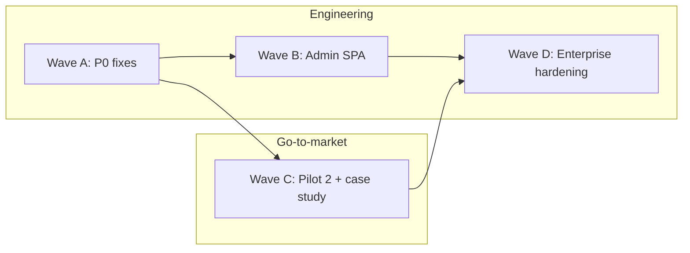

# Market Readiness Plan — EnhancementHub

**Status:** Active — Wave A complete (Phases 73–75)  
**Starting point:** Independent audit **77/100** product quality · **74/100** launch readiness · **68/100** marketability  
**Target:** **Market ready** — **88+ launch readiness**, **85+ marketability**, **90+ enterprise procurement pass rate**

Related: [PRODUCT_SCORECARD.md](PRODUCT_SCORECARD.md) · [ROADMAP_85.md](ROADMAP_85.md) · [DESIGN_PARTNER_2_TRACKER.md](DESIGN_PARTNER_2_TRACKER.md) · [GATE_85_VERIFICATION.md](GATE_85_VERIFICATION.md)

---

## What “market ready” means

Market ready is **not** more features. It is the point where a VP Engineering can buy without implementation heroics, a security team can approve without exceptions, and a sales team can demo without apologizing for UX seams.

### Exit gates (all required)

| Gate | Threshold | Current | Owner |
|------|-----------|---------|-------|
| Launch readiness score | ≥ 88 / 100 | 74 | Product + GTM |
| Marketability score | ≥ 85 / 100 | 68 | GTM |
| Measured design partners | ≥ 2 with ROI data | 1 | Customer success |
| Published case study | ≥ 1 external | Draft only | Marketing |
| Combined pilot NPS | > 40 | 38 (pilot #1 only) | Customer success |
| P0 UX defects | 0 open | 3 (see Wave A) | Engineering |
| SPA demo path | 100% no full reload | ~90% | Engineering |
| Mobile governance surfaces | Usable on tablet | Broken on 6 lists | Engineering |
| axe serious violations (expanded flows) | 0 | 0 on 5 flows | Engineering |
| Security attestation | Pen test report OR SOC 2 Type II in progress | Paper only | Security |
| Sales kit | Demo + security + pricing one-pagers | Partial | Product marketing |

### Score trajectory

| Wave | Phases | Duration | Launch readiness | Marketability |
|------|--------|----------|------------------|---------------|
| A — Launch blockers | 73–75 | 3–4 weeks | 74 → 80 | 68 → 72 |
| B — One product (finish) | 76–78 | 4–6 weeks | 80 → 85 | 72 → 78 |
| C — Market proof | 79–81 | 6–8 weeks (parallel GTM) | 85 → 88 | 78 → 85 |
| D — Enterprise grade | 82–84 | 6–8 weeks | 88 → 90 | 85 → 88 |

---

## Guiding principles

1. **Ship proof before polish** — pilot #2 metrics and published case study unblock revenue; don’t defer GTM behind engineering.
2. **One shell** — extend `SpaShell.tsx`; no third admin navigation model.
3. **P0 before P2** — duplicate command palette and mobile blank tables are launch blockers, not backlog.
4. **Measured gates** — every phase has automated tests or documented acceptance criteria; no checkbox claims.
5. **ICP focus** — optimize for .NET/Azure enterprise architects, not generic SMB ticketing.

---

## Parallel execution tracks

| Track | Lead | Waves |
|-------|------|-------|
| Product / UX | Staff frontend + product design | A, B |
| Platform engineering | Principal architect | B, D |
| GTM / customer success | PM + CS | C (starts week 1) |
| Security / compliance | Security engineer | D |

---

## WAVE A — Launch blockers (Phases 73–75) → 80 launch readiness

**Theme:** Fix issues that cause demo failure, accessibility invalidity, or mobile embarrassment.

### Phase 73 — Command palette & theme unification

| # | Task | Files | Acceptance criteria |
|---|------|-------|---------------------|
| 73.1 | **Remove duplicate command palette** when SPA mounted | `wwwroot/js/site.js` (`initCommandPalette`), `_AppTopBar.cshtml`, `CommandPalette.tsx` | Single ⌘K handler; no duplicate `#commandPaletteInput` IDs; `Phase73CommandPaletteTests` |
| 73.2 | **Unify theme controls** — one preference surface | `_AppTopBar.cshtml` (`data-theme-toggle`), `ThemePreferenceSelector.tsx`, `site.js` (`toggleTheme`) | System/Light/Dark only via selector; top bar toggle removed or synced; `theme.ts` single source |
| 73.3 | Fix theme flash on load | `_Layout.cshtml`, `SpaAppearanceBootstrap` | No FOUC; `readStoredThemePreference()` applied before paint via inline script |
| 73.4 | Replace emoji chrome with SVG icons | `_AppTopBar.cshtml`, `_SidebarIcon` partial pattern | No emoji in top bar (🔔 ◐ ☰) |

**Exit criteria:** axe palette test passes; manual ⌘K works once; theme persists across reload.

---

### Phase 74 — Mobile parity for data surfaces

| # | Task | Files | Acceptance criteria |
|---|------|-------|---------------------|
| 74.1 | Extract `ResponsiveDataList` component | New `components/ResponsiveDataList.tsx`; pattern from `RequestListApp.tsx` | Desktop table + mobile cards from one data model |
| 74.2 | Migrate list apps to responsive pattern | `ApplicationsApp.tsx`, `AuditApp.tsx`, `RepositoriesApp.tsx`, `DatabaseConnectionsApp.tsx`, `RefactorPlansApp.tsx`, `SettingsGeneralSection.tsx` | No blank content below 992px |
| 74.3 | Mobile CSS regression test | `tests/e2e/mobile-lists.spec.ts` | Playwright asserts visible content at 375px width |
| 74.4 | Fix bottom-right UI collision | `site.css` (`.eh-theme-preference-bar`, `.eh-feedback-widget`) | Theme bar + feedback + FAB don’t overlap on mobile |

**Exit criteria:** `mobile-lists.spec.ts` green; design review on iPhone 14 viewport.

---

### Phase 75 — Demo path continuity

| # | Task | Files | Acceptance criteria |
|---|------|-------|---------------------|
| 75.1 | **Application detail in SPA** | New `ApplicationDetailApp.tsx`; route `/Spa/Applications/:id` | `ApplicationsApp.tsx` uses `SpaLink`; no `/Applications/Details` reload |
| 75.2 | Notification preferences in SPA | New `NotificationPreferencesApp.tsx`; route `/Spa/Account/Notifications` | Top bar link from SPA; Razor page redirects |
| 75.3 | Settings header cleanup | `SettingsApp.tsx`, all `Settings*Section.tsx` | Single `PageHeader` in parent; sections use `SectionCard` title only |
| 75.4 | Expand axe E2E to Settings + Onboarding | `tests/e2e/accessibility.spec.ts` | +2 flows; 0 serious violations |
| 75.5 | Update README accuracy | `README.md` | Test count 477+; SPA route list current |

**Exit criteria:** Demo script (`DEMO_SCRIPT.md`) runnable with zero full reloads on happy path.

---

## WAVE B — One product, finished (Phases 76–78) → 85 launch readiness

**Theme:** Eliminate the “two products” feeling for admins and operators.

### Phase 76 — Unified admin SPA shell

| # | Task | Files | Acceptance criteria |
|---|------|-------|---------------------|
| 76.1 | Create `AdminApp.tsx` at `/Spa/Admin/*` | New app + `SpaShell.tsx` route | Nested layout with single left nav |
| 76.2 | Replace `_AdminNav.cshtml` tabs with SPA nav | `AdminNav.tsx`; deprecate `_AdminNav.cshtml` | One admin IA; sidebar + admin nav aligned |
| 76.3 | Migrate **Jobs** to React | `AdminJobsSection.tsx`; BFF `SpaAdminController` | `/Admin/Jobs` → redirect; Hangfire status via existing API |
| 76.4 | Migrate **Custom fields** to React | `AdminCustomFieldsSection.tsx` | Intake custom fields admin in SPA |
| 76.5 | Migrate **Compliance** (SOC2 map) to React | `AdminComplianceSection.tsx` | Read-only SOC2 readiness view |

**Exit criteria:** `Phase76AdminSpaTests`; top 3 admin pages in React; `_AdminNav` unused on migrated pages.

---

### Phase 77 — Remaining admin migration

| # | Task | Files | Acceptance criteria |
|---|------|-------|---------------------|
| 77.1 | Migrate **Tenancy / billing** | `AdminTenancySection.tsx` | Stripe portal links; tenant plan display |
| 77.2 | Migrate **Observability** | `AdminObservabilitySection.tsx` | OTel status from existing API |
| 77.3 | Migrate **Data scaling** | `AdminDataScalingSection.tsx` | Vector provider status |
| 77.4 | Migrate **Retention** | `AdminRetentionSection.tsx` | Retention policy config |
| 77.5 | Migrate **Delivery** + **AI prompts** | `AdminDeliverySection.tsx`, `AdminAiPromptsSection.tsx` | Last Razor admin pages redirect |

**Exit criteria:** Zero `/Admin/*` pages without `[Obsolete]` redirect except login/signup.

---

### Phase 78 — Design system hardening

| # | Task | Files | Acceptance criteria |
|---|------|-------|---------------------|
| 78.1 | Replace raw Bootstrap alerts with `AlertBanner` | `RequestDetailApp.tsx`, `IntakeCopilotPanel.tsx`, `SystemMapApp.tsx`, `OnboardingAdvancedSteps.tsx` | No `alert alert-*` in ClientApp |
| 78.2 | Wire `eh-spa-live-region` | `SpUiRoot.tsx`, `SpaNavigationBridge` | Route changes announced to screen readers |
| 78.3 | `AlertBanner` role fix | `AlertBanner.tsx` | `role="alert"` for danger variant |
| 78.4 | Storybook expansion | Stories for `CommandPalette`, `ResponsiveDataList`, `ThemePreferenceSelector` | `build-storybook` in CI unchanged |
| 78.5 | Add `@storybook/addon-a11y` | `ClientApp/package.json`, `.storybook/main.ts` | a11y panel on UI kit stories |
| 78.6 | Vitest setup + 10 critical tests | `CreateRequestApp`, `ApprovalQueueApp`, `SettingsBrandingSection` | `npm test` in CI |

**Exit criteria:** `Phase78DesignSystemTests`; Vitest job in `ci.yml`.

---

## WAVE C — Market proof (Phases 79–81) → 85 marketability

**Theme:** Revenue-unblocking evidence. **Start week 1 in parallel with Wave A.**

### Phase 79 — Pilot #2 execution

| # | Task | Owner | Acceptance criteria |
|---|------|-------|---------------------|
| 79.1 | Close security questionnaire for *Helix* | CS + security | Signed off in `DESIGN_PARTNER_2_TRACKER.md` |
| 79.2 | Kickoff week 0 — baseline architect hours | CS | Baseline logged in tracker |
| 79.3 | Weeks 1–6 playbook execution | CS | All checklist rows “Done” for pilot #2 |
| 79.4 | Capture metrics in `/Spa/Insights` | CS | Submit→analysis, approval time, linkage %, NPS |
| 79.5 | Combined NPS > 40 | CS | (pilot #1 + #2 weighted) in scorecard |

**Exit criteria:** `DESIGN_PARTNER_2_TRACKER.md` pilot #2 column fully measured.

---

### Phase 80 — Published proof assets

| # | Task | Owner | Acceptance criteria |
|---|------|-------|---------------------|
| 80.1 | Legal review of pilot #1 case study | Marketing + legal | Approved text |
| 80.2 | Publish case study (web or PDF) | Marketing | Public URL in tracker |
| 80.3 | Update `PRODUCT_SCORECARD.md` measured column | Product | Pilot #2 metrics filled |
| 80.4 | Sales one-pager refresh | Marketing | `ICP_ONE_PAGER.md` + 1-page PDF export |
| 80.5 | Record 12-minute demo video | Product | Linked from README / sales kit |

**Exit criteria:** Case study URL live; sales deck references two pilots.

---

### Phase 81 — Conversion & packaging

| # | Task | Owner | Acceptance criteria |
|---|------|-------|---------------------|
| 81.1 | Finalize public pricing page | Product + finance | `PRICING.md` → customer-facing page |
| 81.2 | Self-serve trial flow smoke test | Engineering | Signup → first request < 30 min |
| 81.3 | In-app NPS + feedback on 3 more workflows | Engineering | Portfolio health, settings, onboarding |
| 81.4 | ROI calculator in Insights (export CSV) | Engineering | Executive export for procurement |
| 81.5 | Portfolio health CSV export | Engineering | `SpaPortfolioController` export endpoint |

**Exit criteria:** Trial signup E2E green; CSV export downloadable.

---

## WAVE D — Enterprise grade (Phases 82–84) → 90 launch readiness

**Theme:** Procurement and scale confidence for enterprise buyers.

### Phase 82 — Security attestation

| # | Task | Owner | Acceptance criteria |
|---|------|-------|---------------------|
| 82.1 | Third-party pen test (or bug bounty pilot) | Security | Report with remediated critical/high |
| 82.2 | SOC 2 Type II audit kickoff | Security + legal | Auditor engaged; timeline published |
| 82.3 | SCIM token rotation docs + script | Security | `SECURITY.md` updated |
| 82.4 | Tighten CSP (remove unsafe-eval where possible) | Engineering | `SecurityHeadersMiddleware.cs`; document exceptions |
| 82.5 | Secrets manager integration guide | DevOps | Azure Key Vault / AWS SM in `DEPLOYMENT.md` |

**Exit criteria:** Pen test letter shareable with prospects; SOC 2 “in progress” badge on site.

---

### Phase 83 — Engineering scale defaults

| # | Task | Files | Acceptance criteria |
|---|------|-------|---------------------|
| 83.1 | OTel enabled in production Helm/docker templates | `docker-compose.observability.yml`, `deploy/` | Default `Observability:Enabled=true` in prod samples |
| 83.2 | Migrate 15 more handlers off DbContext | Handlers from allowlist; update `ef-handler-allowlist.txt` | Allowlist ≤ 41 entries |
| 83.3 | Distributed cache for feature flags + search | `IMemoryCache` or Redis behind `IFeatureService` | Cache hit metrics in OTel |
| 83.4 | Make load-smoke blocking in CI | `.github/workflows/ci.yml` | Remove `continue-on-error: true` |
| 83.5 | Chromatic or Percy visual regression | New workflow | PR blocks on UI kit + dashboard diff |
| 83.6 | BFF integration tests (10 routes) | `tests/EnhancementHub.Tests/Integration/SpaBffTests.cs` | Cookie auth → JSON contracts |

**Exit criteria:** `Phase83ScaleDefaultsTests`; allowlist count reduced.

---

### Phase 84 — Market ready gate verification

| # | Task | Acceptance criteria |
|---|------|---------------------|
| 84.1 | Re-run independent audit checklist | `docs/MARKET_READINESS_VERIFICATION.md` — all gates pass |
| 84.2 | 5-person UX re-test (expanded flows) | Update `UX_HEURISTIC_REVIEW.md` — avg ≥ 4.3/5 |
| 84.3 | Update scorecard to market-ready snapshot | `PRODUCT_SCORECARD.md` — launch ≥ 88, marketability ≥ 85 |
| 84.4 | `Phase84MarketReadinessTests.cs` | Automated doc + structural gates |
| 84.5 | Sales + SE sign-off | Sign-off table in verification doc |

**Exit criteria:** **Market ready** stamp; proceed to broad launch.

---

## Sprint allocation (recommended)

| Sprint | Engineering focus | GTM focus (parallel) |
|--------|-------------------|----------------------|
| **1** | Phase 73 + 74.1–74.2 | Pilot #2 security questionnaire |
| **2** | Phase 74.3–74.4 + 75 | Pilot #2 kickoff (week 0) |
| **3** | Phase 76 | Case study legal review |
| **4** | Phase 77 | Pilot #2 weeks 2–4 |
| **5** | Phase 78 + 81.5 | Demo video + pilot metrics |
| **6** | Phase 83.1–83.3 | Publish case study |
| **7** | Phase 82 + 83.4–83.6 | Pricing page + trial smoke |
| **8** | Phase 84 | Launch review |

---

## Quick wins (do in Sprint 1 regardless)

| Task | Effort | Impact |
|------|--------|--------|
| Remove duplicate command palette | S | Critical — demo + a11y |
| Settings double header fix | S | Professional polish |
| README test count fix | S | Diligence credibility |
| Portfolio health empty state → `EmptyState` | S | Consistency |
| Insights empty state when no data | S | Executive UX |

---

## Risk register

| Risk | Mitigation |
|------|------------|
| Pilot #2 delays | Start GTM week 1; don’t wait for Wave B |
| Admin migration scope creep | Migrate read-only pages first; defer complex forms |
| Pen test findings | Budget 2-week remediation buffer in Sprint 7 |
| EF migration breaks tests | 3 handlers per PR max; allowlist CI prevents regression |

---

## Success metrics (track weekly)

| Metric | Baseline | Wave A | Wave C | Market ready |
|--------|----------|--------|--------|--------------|
| Launch readiness (/100) | 74 | 80 | 88 | 90 |
| Marketability (/100) | 68 | 72 | 85 | 88 |
| P0 UX defects open | 3 | 0 | 0 | 0 |
| Razor admin pages (no redirect) | ~10 | ~10 | 0 | 0 |
| axe flows covered | 5 | 7 | 10 | 12 |
| Measured pilots | 1 | 1 | 2 | 2 |
| Published case studies | 0 | 0 | 1 | 1 |
| Combined NPS | 38 | 38 | >40 | >45 |
| DbContext allowlist handlers | 56 | 56 | 50 | ≤41 |

---

## Phase numbering (continues PHASES.md)

| Phase | Name | Wave |
|-------|------|------|
| 73 | Command palette & theme unification | A |
| 74 | Mobile data surface parity | A |
| 75 | Demo path continuity | A |
| 76 | Unified admin SPA (Jobs, Custom fields, Compliance) | B |
| 77 | Remaining admin migration | B |
| 78 | Design system hardening + Vitest | B |
| 79 | Pilot #2 execution | C |
| 80 | Published proof assets | C |
| 81 | Conversion & packaging | C |
| 82 | Security attestation | D |
| 83 | Engineering scale defaults | D |
| 84 | Market ready gate verification | D |

---

*Created: July 2026 — post independent due diligence audit. Execute Waves A + C in parallel from day one.*
